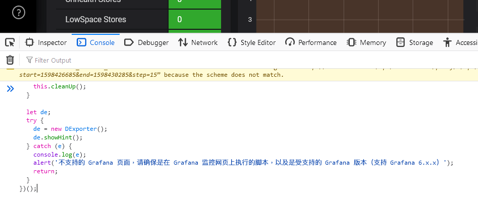
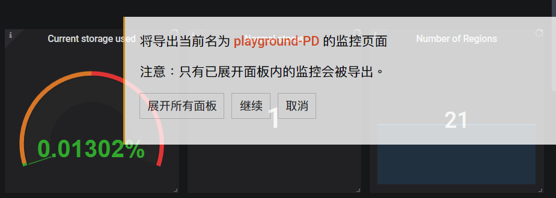
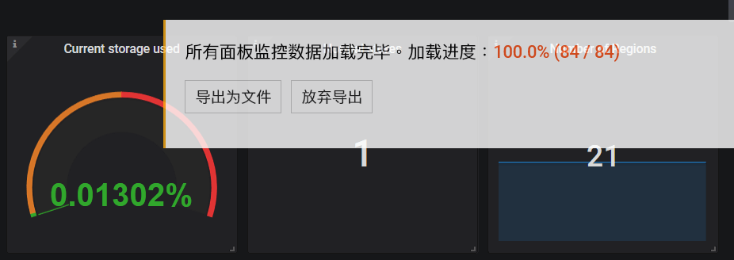

# Export dashboards as snapshot JSON files

## CLI

## Development tools

Suitable when you have access to Grafana via a modern browser (Chrome, Edge, Firefox, Safari), and you are comfortable with running scripts.

1. Login to Grafana

2. Open the dashboard you wish export

3. Press <kbd>F12</kbd> to open development tools, and navigate to Console

4. Copy the entire content of <https://gist.github.com/breeswish/a8c2f766178853dfbc8335b9dfe2a3dd>

5. Paste into the development tools console

    

6. Press <kbd>Enter</kbd>. A new dialog should appear on the dashboard

    

7. Click "展开所有面板"

8. Click "继续"

9. After the progress reaches 100%, click "导出为文件"

    

10. Save the resulting JSON file.

11. Repeat from step 2 for other dashboards.

## Manually

Suitable when you cannot use development tools.

1. Login to Grafana

2. Open the dashboard you wish export

3. Click "Share dashboard" on the toolbar on top-right corner

    

4. Choose the "Snapshot" tab

5. Click "Local Snapshot", and wait until the link is available

    

6. Open the link, and then replace the `dashboard/snapshot` part in the URL by `api/snapshots`, and visit the new link.

     
    ↓ 
    

7. Save the current web page as a JSON file.

8. Repeat from step 2 for other dashboards.

# Visualize snapshot JSON files

## PingCAP service

## Import into local Grafana instance

